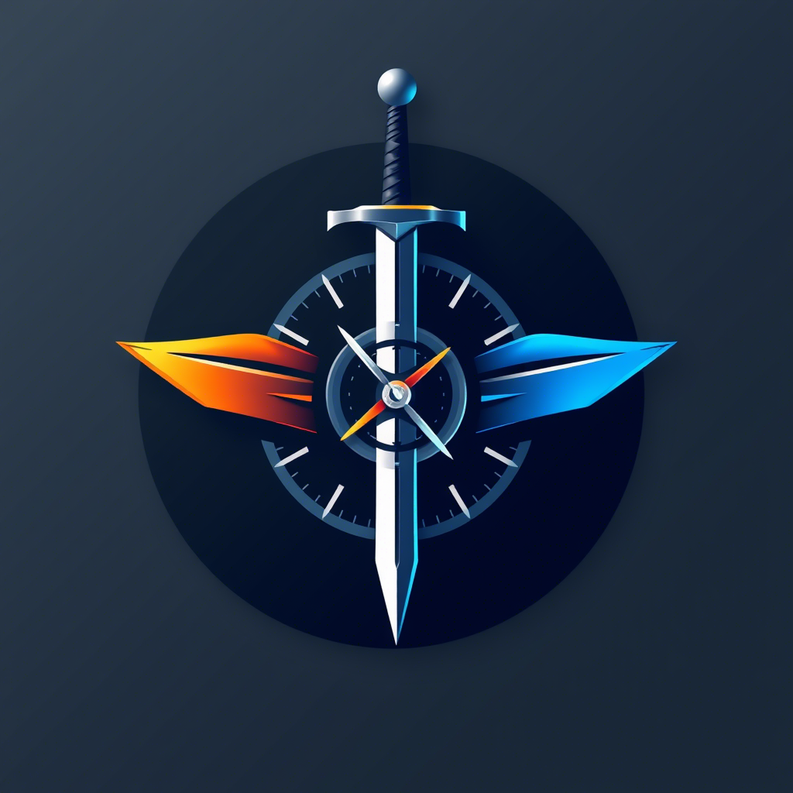

# FencerFight

«FencerFight» — удобный таймер и счётчик для бойцов HEMA. Выбирайте участников, задавайте длительность и зоны ударов, ведите счёт, протесты, предупреждения и обоюдки. Также доступна турнирная сетка с возможностью поделиться результатами. Поддерживает русский, английский и китайский языки.

## EN

«FencerFight» is a sleek HEMA fight timer & scoreboard. Pick fighters, set duration and hit zones, track points, protests, warnings and double hits. A tournament grid is also available with the ability to share the results. Supports Russian, English and Chinese languages.

## CN

«FencerFight» 是一款时尚的 HEMA fight 计时器和记分牌。 挑选战士，设置持续时间和命中区域，跟踪点，抗议，警告和双重命中。 一个锦标赛网格也可以共享结果的能力。 支持俄语，英语和中文语言。

